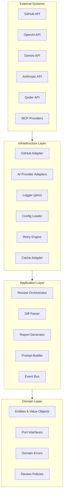
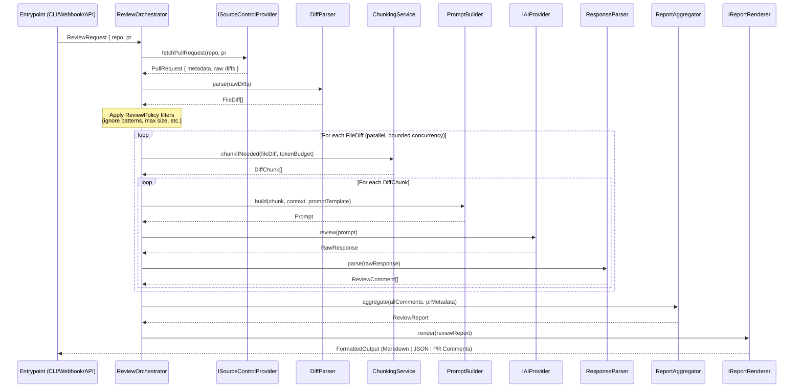
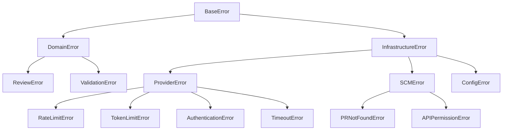
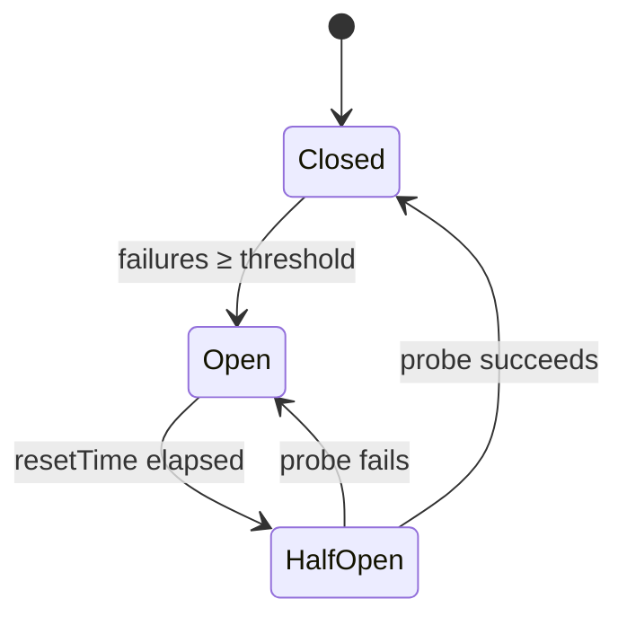
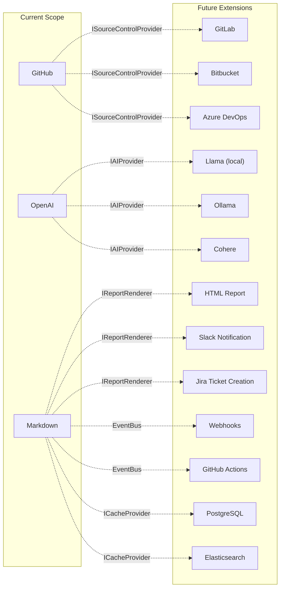

# AI Code Review Orchestrator — Design Document

> **Status**: Draft  
> **Author**: Architecture Review  
> **Date**: 2026-07-30  
> **Stack**: Node.js · TypeScript · Clean Architecture  

---

## 1. High-Level Architecture

The system follows **Clean Architecture** (Ports & Adapters) with four concentric layers. Dependencies point **inward only** — outer layers depend on inner layers, never the reverse.



### Architectural Principles

| Principle | Application |
|-----------|-------------|
| **Single Responsibility** | Each module owns exactly one reason to change |
| **Open/Closed** | New AI providers are added without modifying orchestrator code |
| **Liskov Substitution** | All AI adapters are interchangeable behind `IAIProvider` |
| **Interface Segregation** | Narrow, role-specific port interfaces instead of fat contracts |
| **Dependency Inversion** | Core logic depends on abstractions (ports), not concrete adapters |

---

## 2. Folder Structure

```
ai-code-review-orchestrator/
├── src/
│   ├── domain/                        # Enterprise business rules
│   │   ├── entities/
│   │   │   ├── PullRequest.ts         # PR aggregate root
│   │   │   ├── FileDiff.ts            # Single file diff value object
│   │   │   ├── ReviewComment.ts       # Individual review comment
│   │   │   ├── ReviewReport.ts        # Complete review report entity
│   │   │   └── ReviewSeverity.ts      # Enum: critical | warning | suggestion | praise
│   │   ├── ports/
│   │   │   ├── ISourceControlProvider.ts   # Port for GitHub/GitLab/etc.
│   │   │   ├── IAIProvider.ts              # Port for LLM providers
│   │   │   ├── IReportRenderer.ts          # Port for output formatting
│   │   │   ├── ICacheProvider.ts           # Port for caching layer
│   │   │   └── ILogger.ts                  # Port for structured logging
│   │   ├── errors/
│   │   │   ├── DomainError.ts              # Base domain error
│   │   │   ├── ReviewError.ts              # Review-specific errors
│   │   │   └── ProviderError.ts            # Provider communication errors
│   │   └── policies/
│   │       ├── ReviewPolicy.ts             # Rules: max file size, ignored patterns
│   │       └── ChunkingPolicy.ts           # Rules: how to split large diffs
│   │
│   ├── application/                   # Application business rules
│   │   ├── orchestrator/
│   │   │   ├── ReviewOrchestrator.ts       # Main orchestration workflow
│   │   │   └── ReviewPipeline.ts           # Composable pipeline stages
│   │   ├── services/
│   │   │   ├── DiffParser.ts               # Unified diff → FileDiff[]
│   │   │   ├── PromptBuilder.ts            # Constructs LLM prompts from diffs
│   │   │   ├── ResponseParser.ts           # Parses LLM responses → ReviewComment[]
│   │   │   ├── ReportAggregator.ts         # Merges per-file reviews → ReviewReport
│   │   │   └── ChunkingService.ts          # Splits large diffs for token limits
│   │   ├── dto/
│   │   │   ├── ReviewRequest.ts            # Input DTO
│   │   │   └── ReviewResult.ts             # Output DTO
│   │   └── events/
│   │       ├── EventBus.ts                 # Simple pub/sub event bus
│   │       └── ReviewEvents.ts             # Event type definitions
│   │
│   ├── infrastructure/                # Frameworks & drivers
│   │   ├── providers/
│   │   │   ├── ai/
│   │   │   │   ├── OpenAIAdapter.ts        # OpenAI implementation
│   │   │   │   ├── GeminiAdapter.ts        # Google Gemini implementation
│   │   │   │   ├── AnthropicAdapter.ts     # Anthropic Claude implementation
│   │   │   │   ├── QoderAdapter.ts         # Qoder implementation
│   │   │   │   ├── MCPAdapter.ts           # Generic MCP-compatible adapter
│   │   │   │   └── AIProviderFactory.ts    # Factory for provider instantiation
│   │   │   └── scm/
│   │   │       ├── GitHubAdapter.ts        # GitHub API implementation
│   │   │       └── GitLabAdapter.ts        # Future: GitLab support
│   │   ├── renderers/
│   │   │   ├── MarkdownRenderer.ts         # Markdown report output
│   │   │   ├── JSONRenderer.ts             # JSON report output
│   │   │   └── GitHubPRRenderer.ts         # Posts comments directly to PR
│   │   ├── cache/
│   │   │   ├── InMemoryCache.ts            # Development/testing cache
│   │   │   └── RedisCache.ts              # Production cache adapter
│   │   ├── config/
│   │   │   ├── ConfigLoader.ts             # Env + file config loading
│   │   │   ├── ConfigSchema.ts             # Zod validation schemas
│   │   │   └── defaults.ts                 # Default configuration values
│   │   ├── logging/
│   │   │   └── PinoLogger.ts               # Pino-based structured logger
│   │   ├── retry/
│   │   │   └── RetryEngine.ts              # Retry with backoff logic
│   │   └── di/
│   │       └── Container.ts                # DI container (tsyringe or manual)
│   │
│   ├── entrypoints/                   # Delivery mechanisms
│   │   ├── cli/
│   │   │   └── index.ts                    # CLI entry point
│   │   ├── webhook/
│   │   │   └── GitHubWebhookHandler.ts     # GitHub webhook receiver
│   │   └── api/
│   │       └── HttpServer.ts               # REST API (optional)
│   │
│   └── index.ts                       # Main bootstrap
│
├── config/
│   ├── default.yaml                   # Default config
│   ├── production.yaml                # Production overrides
│   └── prompts/
│       ├── system.md                  # System prompt template
│       ├── review-file.md             # Per-file review prompt
│       └── summarize.md               # Summary prompt template
│
├── tests/
│   ├── unit/
│   │   ├── domain/
│   │   ├── application/
│   │   └── infrastructure/
│   ├── integration/
│   │   ├── providers/
│   │   └── e2e/
│   └── fixtures/
│       ├── diffs/                     # Sample unified diffs
│       └── responses/                 # Sample LLM responses
│
├── tsconfig.json
├── package.json
├── .env.example
└── README.md
```

---

## 3. Responsibilities of Each Module

### Domain Layer

| Module | Responsibility |
|--------|---------------|
| **`PullRequest`** | Aggregate root representing a PR — number, repo, branch, author, list of `FileDiff` entries. Enforces invariants (e.g., PR must have at least one diff). |
| **`FileDiff`** | Value object encapsulating a single file's diff — filename, language, hunks, additions, deletions. Immutable. |
| **`ReviewComment`** | Value object for a single review finding — file, line range, severity, message, suggested fix, confidence score. |
| **`ReviewReport`** | Entity aggregating all `ReviewComment` entries for a PR — overall summary, risk score, statistics, metadata. |
| **`ReviewSeverity`** | Enum defining severity levels: `CRITICAL`, `WARNING`, `SUGGESTION`, `PRAISE`. |
| **`ISourceControlProvider`** | Port interface for fetching PR data and posting review results. |
| **`IAIProvider`** | Port interface for sending prompts and receiving structured review responses. |
| **`IReportRenderer`** | Port interface for rendering `ReviewReport` into various output formats. |
| **`ICacheProvider`** | Port interface for caching review results and API responses. |
| **`ILogger`** | Port interface for structured logging (decouples from any logging library). |
| **`ReviewPolicy`** | Domain rules — max file size to review, glob patterns to ignore, file-type-specific rules. |
| **`ChunkingPolicy`** | Rules for splitting diffs that exceed provider token limits. |

### Application Layer

| Module | Responsibility |
|--------|---------------|
| **`ReviewOrchestrator`** | Central coordinator. Receives a `ReviewRequest`, fetches PR data, fans out file reviews to the AI provider, aggregates results, and returns a `ReviewResult`. This is the primary use case entry point. |
| **`ReviewPipeline`** | Composable pipeline of stages (filter → chunk → review → aggregate → render). Stages can be added/removed/reordered. |
| **`DiffParser`** | Parses unified diff format into structured `FileDiff[]` value objects. Handles edge cases like binary files, renames, and permission changes. |
| **`PromptBuilder`** | Constructs LLM prompts from templates and `FileDiff` data. Supports variable interpolation, language-specific instructions, and provider-specific prompt tuning. |
| **`ResponseParser`** | Parses raw LLM text/JSON responses into structured `ReviewComment[]`. Handles malformed responses gracefully with fallback parsing. |
| **`ReportAggregator`** | Merges per-file `ReviewComment[]` arrays into a single `ReviewReport` with summary statistics, deduplication, and severity ranking. |
| **`ChunkingService`** | Splits large diffs into token-budget-aware chunks. Uses `ChunkingPolicy` rules and provider-specific token limits. |
| **`EventBus`** | Lightweight pub/sub for decoupled lifecycle events (review started, file reviewed, review completed, error occurred). |

### Infrastructure Layer

| Module | Responsibility |
|--------|---------------|
| **`OpenAIAdapter`** | Implements `IAIProvider` using the OpenAI SDK. Handles chat completions, function calling, and structured output modes. |
| **`GeminiAdapter`** | Implements `IAIProvider` using the Google Generative AI SDK. |
| **`AnthropicAdapter`** | Implements `IAIProvider` using the Anthropic SDK. Handles tool use and message-based API. |
| **`QoderAdapter`** | Implements `IAIProvider` for the Qoder API. |
| **`MCPAdapter`** | Generic adapter implementing `IAIProvider` via the Model Context Protocol. Allows any MCP-compatible server to serve as a review provider. |
| **`AIProviderFactory`** | Factory that instantiates the correct `IAIProvider` from a string identifier + config. Supports runtime provider switching. |
| **`GitHubAdapter`** | Implements `ISourceControlProvider` using Octokit. Fetches PR diffs, file lists, and posts review comments/check runs. |
| **`MarkdownRenderer`** | Implements `IReportRenderer` — outputs a Markdown-formatted review report. |
| **`JSONRenderer`** | Implements `IReportRenderer` — outputs machine-readable JSON. |
| **`GitHubPRRenderer`** | Implements `IReportRenderer` — posts inline comments and a summary directly to the GitHub PR. |
| **`RetryEngine`** | Generic retry wrapper with exponential backoff, jitter, circuit breaker, and per-provider configuration. |
| **`ConfigLoader`** | Loads and merges configuration from env vars → YAML files → CLI flags. Validates with Zod schemas. |
| **`PinoLogger`** | Implements `ILogger` using pino. Structured JSON logging with context binding (PR number, provider, file). |
| **`Container`** | Lightweight DI container. Wires up all dependencies at bootstrap. Uses tsyringe or a manual registry. |

### Entrypoints

| Module | Responsibility |
|--------|---------------|
| **`CLI`** | Accepts `--repo`, `--pr`, `--provider` flags. Bootstraps the container and triggers a review. |
| **`GitHubWebhookHandler`** | Receives `pull_request.opened` / `synchronize` webhook events and triggers reviews automatically. |
| **`HttpServer`** | Optional REST API for triggering reviews programmatically. |

---

## 4. Data Flow



### Data Flow Summary

1. **Trigger** — An entrypoint receives a review request (CLI args, webhook payload, or API call).
2. **Fetch** — The orchestrator calls the SCM adapter to retrieve PR metadata and raw diffs.
3. **Parse** — Raw unified diffs are parsed into structured `FileDiff[]` value objects.
4. **Filter** — `ReviewPolicy` removes files matching ignore patterns, binary files, and files exceeding size limits.
5. **Chunk** — Large diffs are split into token-budget-aware chunks based on `ChunkingPolicy`.
6. **Review** — Each chunk is sent to the AI provider. Files are reviewed in parallel with bounded concurrency (configurable, default `p=5`).
7. **Parse Response** — Raw LLM responses are parsed into structured `ReviewComment[]` objects.
8. **Aggregate** — All comments are merged, deduplicated, and ranked by severity into a `ReviewReport`.
9. **Render** — The report is formatted and delivered (Markdown file, JSON output, or direct PR comments).

---

## 5. Provider Abstraction

### Core Port Interface

```typescript
// domain/ports/IAIProvider.ts

interface IAIProvider {
  readonly name: string;
  readonly maxTokens: number;

  review(request: AIReviewRequest): Promise<AIReviewResponse>;
  healthCheck(): Promise<boolean>;
  estimateTokens(text: string): number;
}

interface AIReviewRequest {
  systemPrompt: string;
  userPrompt: string;
  responseFormat?: 'json' | 'text';
  temperature?: number;
  maxResponseTokens?: number;
  metadata?: Record<string, unknown>;  // Provider-specific pass-through
}

interface AIReviewResponse {
  content: string;
  usage: TokenUsage;
  model: string;
  latencyMs: number;
  raw?: unknown;  // Raw provider response for debugging
}

interface TokenUsage {
  promptTokens: number;
  completionTokens: number;
  totalTokens: number;
}
```

### Provider Factory

```typescript
// infrastructure/providers/ai/AIProviderFactory.ts

interface AIProviderConfig {
  provider: 'openai' | 'gemini' | 'anthropic' | 'qoder' | 'mcp' | string;
  apiKey: string;
  model: string;
  baseUrl?: string;
  options?: Record<string, unknown>;
}

class AIProviderFactory {
  private registry: Map<string, AIProviderConstructor> = new Map();

  register(name: string, constructor: AIProviderConstructor): void { ... }
  create(config: AIProviderConfig): IAIProvider { ... }
}
```

### Provider Registration (Plugin Pattern)

```typescript
// Bootstrap
factory.register('openai', OpenAIAdapter);
factory.register('gemini', GeminiAdapter);
factory.register('anthropic', AnthropicAdapter);
factory.register('qoder', QoderAdapter);
factory.register('mcp', MCPAdapter);

// Adding a new provider requires:
// 1. Create NewAdapter implementing IAIProvider
// 2. factory.register('new', NewAdapter)
// Zero changes to orchestrator or any other module.
```

### Multi-Provider Support

The orchestrator supports reviewing with **multiple providers simultaneously** for consensus-based reviews:

```typescript
interface MultiProviderConfig {
  providers: AIProviderConfig[];
  strategy: 'first' | 'consensus' | 'fallback';
  // first:     Use only the first provider
  // consensus: Review with all, merge results
  // fallback:  Try providers in order until one succeeds
}
```

---

## 6. Error Handling Strategy

### Error Hierarchy



```typescript
// domain/errors/DomainError.ts

abstract class BaseError extends Error {
  abstract readonly code: string;
  abstract readonly isRetryable: boolean;
  abstract readonly httpStatus: number;
  readonly timestamp: Date = new Date();
  readonly context: Record<string, unknown>;

  constructor(message: string, context?: Record<string, unknown>, cause?: Error) {
    super(message);
    this.cause = cause;
    this.context = context ?? {};
  }

  toJSON(): ErrorPayload { ... }
}
```

### Error Handling Rules

| Error Type | Retryable | Action |
|-----------|-----------|--------|
| `RateLimitError` | ✅ | Retry with backoff respecting `Retry-After` header |
| `TokenLimitError` | ✅ | Re-chunk with smaller budget, then retry |
| `TimeoutError` | ✅ | Retry with increased timeout (up to max) |
| `AuthenticationError` | ❌ | Fail fast, log, alert |
| `PRNotFoundError` | ❌ | Fail fast with descriptive message |
| `ValidationError` | ❌ | Fail fast, return validation details |
| `ProviderError` (generic) | ✅ | Retry, then fallback to next provider if configured |

### Graceful Degradation

- If a single file review fails after all retries, **skip that file** and include a warning in the report rather than failing the entire review.
- If the AI response is malformed, attempt **fallback parsing** (regex extraction) before reporting a parse failure.
- If all providers fail, generate a **partial report** with successfully reviewed files and a clear error section.

---

## 7. Retry Strategy

### Retry Engine Design

```typescript
// infrastructure/retry/RetryEngine.ts

interface RetryConfig {
  maxAttempts: number;           // Default: 3
  initialDelayMs: number;        // Default: 1000
  maxDelayMs: number;            // Default: 30000
  backoffMultiplier: number;     // Default: 2
  jitterFactor: number;          // Default: 0.1 (10% jitter)
  retryableErrors: string[];     // Error codes to retry
  circuitBreaker?: {
    failureThreshold: number;    // Default: 5
    resetTimeMs: number;         // Default: 60000
  };
}

class RetryEngine {
  async execute<T>(
    operation: () => Promise<T>,
    config: RetryConfig,
    context: RetryContext
  ): Promise<T>;
}
```

### Per-Provider Retry Configuration

```yaml
# config/default.yaml
retry:
  openai:
    maxAttempts: 3
    initialDelayMs: 1000
    backoffMultiplier: 2
    retryableErrors: ['RATE_LIMIT', 'TIMEOUT', 'SERVER_ERROR']
  anthropic:
    maxAttempts: 4
    initialDelayMs: 500
    backoffMultiplier: 1.5
    retryableErrors: ['RATE_LIMIT', 'OVERLOADED', 'TIMEOUT']
  github:
    maxAttempts: 3
    initialDelayMs: 2000
    retryableErrors: ['RATE_LIMIT', 'SERVER_ERROR']
```

### Backoff Formula

```
delay = min(initialDelay × multiplier^(attempt-1) + random(jitter), maxDelay)
```

### Circuit Breaker

Each provider instance has an independent circuit breaker. After `failureThreshold` consecutive failures, the circuit **opens** and all requests to that provider fail immediately for `resetTimeMs`, after which a single probe request is attempted. If the probe succeeds, the circuit closes and normal operation resumes.



---

## 8. Logging Strategy

### Logger Port

```typescript
// domain/ports/ILogger.ts

interface ILogger {
  debug(message: string, context?: LogContext): void;
  info(message: string, context?: LogContext): void;
  warn(message: string, context?: LogContext): void;
  error(message: string, error?: Error, context?: LogContext): void;
  child(bindings: Record<string, unknown>): ILogger;
}

interface LogContext {
  [key: string]: unknown;
}
```

### Structured Log Format

All logs are emitted as JSON for machine parsing:

```json
{
  "level": "info",
  "timestamp": "2026-07-30T13:15:06.123Z",
  "message": "File review completed",
  "correlationId": "rev_abc123",
  "pr": 42,
  "repo": "org/repo",
  "file": "src/utils.ts",
  "provider": "openai",
  "model": "gpt-4o",
  "latencyMs": 2340,
  "tokensUsed": 1523,
  "commentsGenerated": 3
}
```

### Log Levels & Usage

| Level | Usage |
|-------|-------|
| **`debug`** | Raw prompts, raw LLM responses, parsed diff details, cache hits/misses |
| **`info`** | Review started/completed, file reviewed, report generated, config loaded |
| **`warn`** | Retry attempts, fallback parsing used, file skipped, partial results |
| **`error`** | Provider failures, authentication errors, unrecoverable errors |

### Context Binding

The orchestrator creates a **child logger** for each review session, pre-bound with `correlationId`, `repo`, and `pr`. Each file review further creates a child bound with `file` and `provider`. This eliminates repetitive context passing.

```
Root Logger
└── Review Session Logger  {correlationId, repo, pr}
    ├── File Logger  {file: "src/a.ts", provider: "openai"}
    └── File Logger  {file: "src/b.ts", provider: "openai"}
```

### Sensitive Data

- API keys are **never logged**. The logger redacts any field matching `/key|token|secret|password/i`.
- Raw LLM prompts containing source code are logged at `debug` level only and can be disabled in production via config.

---

## 9. Configuration Strategy

### Configuration Hierarchy (highest priority wins)

```
CLI flags  →  Environment variables  →  .env file  →  config/{env}.yaml  →  config/default.yaml  →  Hardcoded defaults
```

### Configuration Schema (validated with Zod at startup)

```typescript
// infrastructure/config/ConfigSchema.ts

const ConfigSchema = z.object({
  // AI Provider
  ai: z.object({
    provider: z.enum(['openai', 'gemini', 'anthropic', 'qoder', 'mcp']),
    model: z.string(),
    apiKey: z.string().min(1),
    baseUrl: z.string().url().optional(),
    temperature: z.number().min(0).max(2).default(0.1),
    maxResponseTokens: z.number().default(4096),
  }),

  // GitHub
  github: z.object({
    token: z.string().min(1),
    apiUrl: z.string().url().default('https://api.github.com'),
    webhookSecret: z.string().optional(),
  }),

  // Review Behavior
  review: z.object({
    maxFileSizeBytes: z.number().default(100_000),
    maxFilesPerReview: z.number().default(50),
    concurrency: z.number().min(1).max(20).default(5),
    ignorePatterns: z.array(z.string()).default([
      '**/*.lock', '**/node_modules/**', '**/*.min.js',
      '**/dist/**', '**/*.generated.*',
    ]),
    languages: z.array(z.string()).optional(),  // null = all languages
    severity: z.object({
      minLevel: z.enum(['critical', 'warning', 'suggestion', 'praise']).default('suggestion'),
    }),
  }),

  // Output
  output: z.object({
    format: z.enum(['markdown', 'json', 'github-pr']).default('markdown'),
    postToGitHub: z.boolean().default(false),
  }),

  // Retry (per-provider overrides merged onto defaults)
  retry: z.record(z.string(), RetryConfigSchema).default({}),

  // Logging
  logging: z.object({
    level: z.enum(['debug', 'info', 'warn', 'error']).default('info'),
    pretty: z.boolean().default(false),  // Human-readable in dev
    redactKeys: z.array(z.string()).default(['apiKey', 'token', 'secret']),
  }),
});
```

### Example `default.yaml`

```yaml
ai:
  provider: openai
  model: gpt-4o
  temperature: 0.1
  maxResponseTokens: 4096

review:
  maxFileSizeBytes: 100000
  maxFilesPerReview: 50
  concurrency: 5
  ignorePatterns:
    - "**/*.lock"
    - "**/node_modules/**"
    - "**/*.min.js"
    - "**/dist/**"

output:
  format: markdown
  postToGitHub: false

logging:
  level: info
  pretty: false
```

### Environment Variable Mapping

Environment variables follow the pattern `AICR_{SECTION}_{KEY}`:

```bash
AICR_AI_PROVIDER=openai
AICR_AI_API_KEY=sk-...
AICR_AI_MODEL=gpt-4o
AICR_GITHUB_TOKEN=ghp_...
AICR_REVIEW_CONCURRENCY=10
AICR_LOGGING_LEVEL=debug
```

---

## 10. Future Extensibility

### Extension Points

The architecture is designed with the following **seams** for future growth, each requiring zero modification to the orchestrator core:



### Planned Extension Capabilities

| Extension Area | Mechanism | Effort |
|---------------|-----------|--------|
| **New AI provider** | Implement `IAIProvider`, register in factory | 1 file |
| **New SCM platform** (GitLab, Bitbucket) | Implement `ISourceControlProvider` | 1 file |
| **New output format** (HTML, Slack, Jira) | Implement `IReportRenderer` | 1 file |
| **Custom review rules** | Add to `ReviewPolicy` config | Config change |
| **Custom prompt templates** | Add `.md` file in `config/prompts/` | Config change |
| **Pipeline plugins** | Add a stage to `ReviewPipeline` | 1 file |
| **Persistent storage** | Implement `ICacheProvider` for DB | 1 file |
| **Notification hooks** | Subscribe to `EventBus` events | 1 listener |

### MCP Protocol Support

The `MCPAdapter` is a **first-class citizen**, enabling:
- Connection to any MCP-compatible tool server
- Dynamic discovery of provider capabilities
- Tool-use workflows where the LLM can call external tools during review
- Future support for MCP sampling, where the review tool itself becomes an MCP server

### Plugin Architecture (Future)

For v2, the system can evolve to support **dynamic plugin loading**:

```typescript
// Future: Dynamic plugin discovery
interface IPlugin {
  name: string;
  version: string;
  register(container: Container): void;
}

// Plugins loaded from node_modules or a plugins/ directory
// e.g., npm install @aicr/plugin-gitlab
```

### Review Mode Extensions

| Mode | Description |
|------|-------------|
| **Security Audit** | Specialized prompts focusing on OWASP Top 10, secrets detection |
| **Performance Review** | Focus on algorithmic complexity, memory leaks, N+1 queries |
| **Accessibility Review** | Review UI code for WCAG compliance |
| **Migration Assistant** | Review PRs in context of a framework migration |
| **Consensus Review** | Multiple providers review independently, results are merged with conflict resolution |

---

## Appendix A: Dependency Injection Wiring

```typescript
// infrastructure/di/Container.ts — Bootstrap

function bootstrap(config: AppConfig): Container {
  const container = new Container();

  // Logging
  container.registerSingleton<ILogger>(PinoLogger, config.logging);

  // Retry
  container.registerSingleton(RetryEngine, config.retry);

  // AI Provider
  const aiFactory = new AIProviderFactory();
  aiFactory.register('openai', OpenAIAdapter);
  aiFactory.register('gemini', GeminiAdapter);
  aiFactory.register('anthropic', AnthropicAdapter);
  aiFactory.register('qoder', QoderAdapter);
  aiFactory.register('mcp', MCPAdapter);
  container.registerSingleton<IAIProvider>(aiFactory.create(config.ai));

  // SCM
  container.registerSingleton<ISourceControlProvider>(GitHubAdapter, config.github);

  // Services
  container.register(DiffParser);
  container.register(PromptBuilder, config.prompts);
  container.register(ResponseParser);
  container.register(ChunkingService, config.review);
  container.register(ReportAggregator);

  // Renderer
  container.registerSingleton<IReportRenderer>(
    resolveRenderer(config.output.format)
  );

  // Orchestrator
  container.register(ReviewOrchestrator);

  return container;
}
```

## Appendix B: Key Design Decisions

| Decision | Rationale |
|----------|-----------|
| **Ports & Adapters over layered architecture** | Maximizes testability — every external dependency is behind an interface and can be mocked. |
| **Factory + Registry over `if/switch` for providers** | Adding a provider never touches existing code (Open/Closed). |
| **Event Bus over direct coupling** | Enables future integrations (notifications, metrics, webhooks) without modifying the review pipeline. |
| **Zod for config validation** | Runtime type safety with excellent error messages. No decorator metadata required. |
| **pino for logging** | Fastest Node.js structured logger. JSON output is aggregation-friendly. |
| **Bounded concurrency over unbounded parallelism** | Prevents rate limiting and resource exhaustion when reviewing large PRs. |
| **Prompt templates as external files** | Enables prompt iteration without code changes or redeployment. |
| **Correlation IDs on all log entries** | Enables tracing a single review through all log aggregation systems. |
| **Circuit breaker per provider** | Prevents cascading failures when a provider is experiencing an outage. |
| **Graceful degradation** | Partial reviews are more useful than complete failures. The system prioritizes returning *something* useful. |
