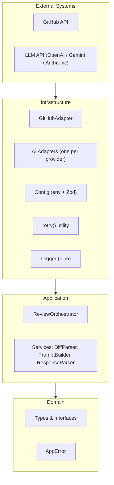
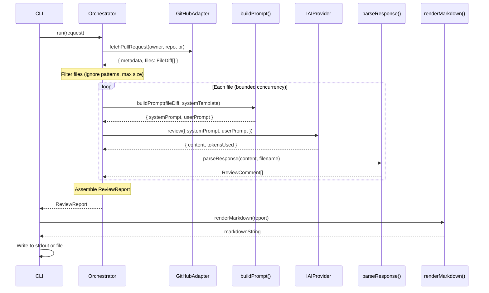

# AI Code Review Orchestrator — V1 Simplified Design

> **Status**: V1 MVP — Simplified  
> **Supersedes**: [Original Design](file:///Users/dabeeovina/.gemini/antigravity-ide/brain/782af026-5bab-4887-b637-f8300bf4eb57/ai_code_review_orchestrator_design.md)  
> **Date**: 2026-07-30  
> **Stack**: Node.js · TypeScript  
> **Target LOC**: ~2000–2500  

---

## Audit Summary

The original design is a solid V3 architecture. For a V1 shipping under 3000 LOC, it contains significant over-engineering. This document strips it to the minimum required to **review a GitHub PR with one LLM provider and output a Markdown report**.

---

## What Was Removed (will NOT exist in V1)

These items are **permanently out of scope** for V1. They are not postponed — they are deleted from the design. They can be re-introduced in a future version if a real need emerges.

| # | Removed Item | Reason |
|---|-------------|--------|
| 1 | **Event Bus** (`EventBus`, `ReviewEvents`) | No consumer exists. Adds a pub/sub system with zero subscribers. Pure YAGNI. Direct function calls are sufficient. |
| 2 | **Review Pipeline** (`ReviewPipeline`) | A composable, reorderable pipeline framework for 5 hardcoded steps is an abstraction over nothing. The orchestrator calls steps directly. |
| 3 | **Circuit Breaker** | A V1 CLI tool does not process enough sustained traffic to trip a circuit breaker. If the provider is down, retries fail and the process exits. |
| 4 | **Multi-Provider Strategy** (`consensus`, `fallback`) | V1 uses one provider per invocation. Consensus review and automatic fallback chains are research features, not MVP. |
| 5 | **Cache Layer** (`ICacheProvider`, `InMemoryCache`, `RedisCache`) | V1 is a stateless CLI run. There is nothing to cache between invocations. No cache port, no cache adapters. |
| 6 | **ILogger Port Interface** | Abstracting the logger behind a domain port is over-engineering for V1. Use pino directly as an imported module. If we swap loggers (we won't), it's a find-and-replace. |
| 7 | **IReportRenderer Port Interface** | V1 outputs Markdown only. A renderer abstraction for one implementation is a pointless indirection. When a second format is needed, extract the interface then. |
| 8 | **DI Container** (`Container.ts`, tsyringe) | 20 source files do not need a service locator. Manual construction in a `bootstrap()` function is simpler, more explicit, and fully type-safe. |
| 9 | **Plugin Architecture** (`IPlugin`, dynamic loading) | This was speculative futurism. No one will write plugins for an unreleased tool. |
| 10 | **Per-Provider Retry Configuration** | One global retry config. All HTTP APIs fail the same way (429, 500, timeout). Per-provider tuning is premature optimization. |
| 11 | **`ChunkingPolicy` as domain object** | A policy object wrapping two numbers (`maxTokens`, `overlapLines`) adds no value. Pass them as config values. |
| 12 | **`ReviewPolicy` as domain object** | Ignore patterns and max file size are config values, not domain rules. A `filterFiles()` utility function is sufficient. |

---

## What Was Postponed (tracked for V2)

These items have clear value but are not required for the first working version. The architecture preserves seams so they can be added without refactoring.

| # | Postponed Item | V1 Seam | Trigger to Add |
|---|---------------|---------|----------------|
| 1 | **Webhook Entrypoint** (`GitHubWebhookHandler`) | Orchestrator is entrypoint-agnostic; accepts a `ReviewRequest` object | When CI/CD integration is needed |
| 2 | **HTTP API Entrypoint** (`HttpServer`) | Same as above | When a dashboard or external system needs to trigger reviews |
| 3 | **GitLab Adapter** | `IGitHubClient` interface already exists; rename to `ISourceControl` when a second SCM is needed | When a user requests GitLab support |
| 4 | **MCP Adapter** | `IAIProvider` interface is stable | When MCP protocol matures and a concrete use case appears |
| 5 | **Qoder Adapter** | `IAIProvider` interface is stable | When Qoder API docs are finalized |
| 6 | **JSON Renderer** | Trivial: `JSON.stringify(report)` | When machine-readable output is requested |
| 7 | **GitHub PR Comment Renderer** | `GitHubAdapter` already has the API client | When users want inline PR comments instead of report files |
| 8 | **`ISourceControlProvider` generalization** | V1 types GitHub directly; extract interface when a second SCM arrives | Second SCM provider |
| 9 | **Config file support** (YAML, multi-env) | V1 uses env vars + `.env` only. Adding YAML is additive. | When deployment complexity demands it |
| 10 | **Review Modes** (Security, Performance, etc.) | Different prompt templates; no code change needed | When specialized prompts are written and tested |
| 11 | **Sensitive data redaction in logs** | V1 just never logs secrets (code discipline). Automated redaction is a V2 polish. | When team size grows or compliance requires it |

---

## 1. High-Level Architecture (Simplified)

Three layers. No event bus. No cache. No plugin system. Dependencies still point inward.



### What Changed

| Original | V1 |
|----------|-----|
| 4 layers (Domain, Application, Infrastructure, Entrypoints) | 3 layers + a thin CLI entry file |
| Event Bus in Application layer | Removed entirely |
| Cache Adapter in Infrastructure | Removed entirely |
| DI Container in Infrastructure | Replaced with manual `bootstrap()` |
| 6 port interfaces | 1 port interface (`IAIProvider`) |
| Factory + Registry pattern | Simple `switch` in `createProvider()` |

---

## 2. Folder Structure

~20 source files. Flat where possible. No single-file directories.

```
ai-code-review-orchestrator/
├── src/
│   ├── domain/
│   │   ├── types.ts              # All entities, value objects, enums in ONE file
│   │   ├── errors.ts             # Single AppError class + error codes enum
│   │   └── ports.ts              # IAIProvider interface only
│   │
│   ├── application/
│   │   ├── orchestrator.ts       # ReviewOrchestrator (main workflow)
│   │   ├── diff-parser.ts        # Unified diff → FileDiff[]
│   │   ├── prompt-builder.ts     # Template interpolation → prompt string
│   │   └── response-parser.ts    # LLM response → ReviewComment[]
│   │
│   ├── infrastructure/
│   │   ├── github.ts             # GitHub API (Octokit): fetch diffs, PR metadata
│   │   ├── providers/
│   │   │   ├── openai.ts         # OpenAI adapter
│   │   │   ├── gemini.ts         # Gemini adapter
│   │   │   ├── anthropic.ts      # Anthropic adapter
│   │   │   └── index.ts          # createProvider() switch function
│   │   ├── config.ts             # Env loading + Zod schema + validation
│   │   ├── retry.ts              # retry() generic utility function
│   │   ├── logger.ts             # pino instance, pre-configured
│   │   └── renderer.ts          # renderMarkdown(report): string
│   │
│   └── cli.ts                    # CLI entry: parse args → bootstrap → run
│
├── prompts/
│   ├── system.md                 # System prompt template
│   └── review-file.md            # Per-file review prompt template
│
├── tests/
│   ├── unit/
│   │   ├── diff-parser.test.ts
│   │   ├── prompt-builder.test.ts
│   │   ├── response-parser.test.ts
│   │   └── orchestrator.test.ts
│   ├── integration/
│   │   └── providers.test.ts
│   └── fixtures/
│       ├── sample.diff
│       └── sample-response.json
│
├── .env.example
├── tsconfig.json
├── package.json
└── README.md
```

### File Count Comparison

| | Original | V1 |
|---|---------|-----|
| Source files | ~40 | ~17 |
| Domain files | 10 | 3 |
| Port interfaces | 5 | 1 |
| AI adapters | 5 | 3 |
| Renderers | 3 | 1 |
| Entrypoints | 3 | 1 |
| Config files | 3 | 1 |

---

## 3. Module Responsibilities

### Domain Layer (3 files)

#### `types.ts`
All types in one file. No separate entity files — we don't have enough types to justify the indirection.

```typescript
// Enums
enum ReviewSeverity { CRITICAL, WARNING, SUGGESTION, PRAISE }

// Value Objects
interface FileDiff {
  filename: string;
  language: string;
  patch: string;          // Raw unified diff hunk
  additions: number;
  deletions: number;
}

interface ReviewComment {
  file: string;
  line: number;
  severity: ReviewSeverity;
  message: string;
  suggestion?: string;    // Optional suggested fix
}

// Entities
interface ReviewReport {
  repo: string;
  prNumber: number;
  prTitle: string;
  comments: ReviewComment[];
  summary: string;        // LLM-generated overall summary
  reviewedFiles: string[];
  skippedFiles: string[]; // Files that were filtered or errored
  metadata: {
    provider: string;
    model: string;
    totalTokens: number;
    durationMs: number;
    timestamp: string;
  };
}

// Input
interface ReviewRequest {
  owner: string;
  repo: string;
  prNumber: number;
  provider: string;       // 'openai' | 'gemini' | 'anthropic'
}
```

#### `errors.ts`
One error class. No hierarchy. Error codes as an enum. `isRetryable` as a property.

```typescript
enum ErrorCode {
  RATE_LIMIT = 'RATE_LIMIT',
  AUTH_FAILED = 'AUTH_FAILED',
  PROVIDER_ERROR = 'PROVIDER_ERROR',
  TIMEOUT = 'TIMEOUT',
  PARSE_ERROR = 'PARSE_ERROR',
  GITHUB_ERROR = 'GITHUB_ERROR',
  CONFIG_ERROR = 'CONFIG_ERROR',
  VALIDATION_ERROR = 'VALIDATION_ERROR',
}

class AppError extends Error {
  constructor(
    public readonly code: ErrorCode,
    message: string,
    public readonly isRetryable: boolean = false,
    public readonly cause?: Error,
  ) { ... }
}
```

> [!IMPORTANT]
> The original design had a 12-class error hierarchy (`BaseError → DomainError → ReviewError`, `InfrastructureError → ProviderError → RateLimitError`, etc.). For V1, **one class with an error code enum gives us the same runtime behavior** (retryable classification, error identification) without 11 extra files. If error handling logic diverges significantly per type, promote specific codes to subclasses then.

#### `ports.ts`
One interface. Only `IAIProvider`. This is the only abstraction that earns its existence in V1 — we have 3 concrete implementations.

```typescript
interface IAIProvider {
  readonly name: string;

  review(request: {
    systemPrompt: string;
    userPrompt: string;
    temperature?: number;
  }): Promise<{
    content: string;
    tokensUsed: number;
    model: string;
  }>;
}
```

> [!NOTE]
> Compared to the original, removed: `healthCheck()`, `estimateTokens()`, `maxTokens`, `responseFormat`, `maxResponseTokens`, `metadata`, `latencyMs`, `raw`, and the full `TokenUsage` breakdown. None of these are needed to produce a review. They can be added to the interface when a feature requires them.

---

### Application Layer (4 files)

#### `orchestrator.ts` — `ReviewOrchestrator`
The core workflow. Receives dependencies via constructor. No base class, no pipeline abstraction. Just a `run()` method with clear sequential steps.

**Responsibilities:**
1. Calls `GitHubAdapter` to fetch PR metadata and file diffs
2. Filters files using config (ignore patterns, max size)
3. Iterates files with bounded concurrency (`Promise.allSettled` + semaphore)
4. For each file: build prompt → call AI provider → parse response
5. Collects all comments, attaches skipped/errored files
6. Returns `ReviewReport`

**Not responsible for:** Rendering output, CLI argument parsing, config loading.

#### `diff-parser.ts` — `parseDiff()`
Pure function. Takes raw GitHub diff (array of file objects from the API) and returns `FileDiff[]`. No class needed — it's a stateless transformation.

#### `prompt-builder.ts` — `buildPrompt()`
Pure function. Reads prompt templates from `prompts/` directory, interpolates `FileDiff` data into them. Returns a `{ systemPrompt, userPrompt }` object.

#### `response-parser.ts` — `parseResponse()`
Pure function. Takes raw LLM string response, extracts structured `ReviewComment[]`. Strategy:
1. Try `JSON.parse()` (if we asked for JSON output)
2. Fallback: regex extraction of code review patterns
3. Last resort: return single comment with the raw text

---

### Infrastructure Layer (9 files)

#### `github.ts` — `GitHubAdapter`
Concrete class using Octokit. Not behind an interface (YAGNI — we only support GitHub).

**Methods:**
- `fetchPullRequest(owner, repo, prNumber)` → PR metadata + `FileDiff[]`
- Posts no comments in V1 (output is Markdown to stdout/file)

#### `providers/openai.ts`, `gemini.ts`, `anthropic.ts`
Each implements `IAIProvider`. ~60–80 lines each. Wraps the vendor SDK. Catches vendor-specific errors and wraps them in `AppError` with appropriate `ErrorCode`.

#### `providers/index.ts` — `createProvider()`
A simple `switch` statement. Not a factory class. Not a registry.

```typescript
function createProvider(config: AppConfig): IAIProvider {
  switch (config.ai.provider) {
    case 'openai':    return new OpenAIAdapter(config.ai);
    case 'gemini':    return new GeminiAdapter(config.ai);
    case 'anthropic': return new AnthropicAdapter(config.ai);
    default:          throw new AppError(ErrorCode.CONFIG_ERROR, `Unknown provider: ${config.ai.provider}`);
  }
}
```

> [!NOTE]
> The original used a `Factory + Registry` pattern with `Map<string, Constructor>` and `factory.register()`. That pattern pays off at ~6+ implementations or when third parties need to register providers at runtime. At 3 providers, a `switch` is more readable, more debuggable, and fully type-checked. When a 4th or 5th provider is added, evaluate upgrading to a registry.

#### `config.ts`
Loads from environment variables (+ `.env` file via `dotenv`). Validates with Zod. Exports a typed `AppConfig` object. No YAML. No multi-environment file hierarchy.

#### `retry.ts`
A single exported `retry()` function. ~40 lines. Not a class.

```typescript
async function retry<T>(
  fn: () => Promise<T>,
  opts?: { maxAttempts?: number; initialDelayMs?: number; maxDelayMs?: number }
): Promise<T>;
```

#### `logger.ts`
Exports a pre-configured pino instance. Child loggers created inline where needed. No `ILogger` port.

```typescript
import pino from 'pino';
export const logger = pino({ level: config.logging.level });
```

#### `renderer.ts`
A single `renderMarkdown(report: ReviewReport): string` function. Not a class. Not behind an interface. Produces a Markdown string from a `ReviewReport`.

---

### Entrypoint (1 file)

#### `cli.ts`
Parses CLI args (use `commander` or bare `process.argv`). Calls `bootstrap()` to wire dependencies. Calls `orchestrator.run()`. Prints the rendered Markdown to stdout. Exits with code 0 or 1.

```
Usage: ai-review --owner <owner> --repo <repo> --pr <number> [--provider openai|gemini|anthropic]
```

---

## 4. Data Flow (Simplified)



### What Changed from Original

- Removed `ChunkingService` step (V1 sends full file diffs; if a file exceeds token limits, the provider returns an error and we skip it with a warning)
- Removed `ReportAggregator` as a separate service (the orchestrator builds the `ReviewReport` directly — it's collecting comments into an array and attaching metadata, not complex aggregation logic)
- Removed `EventBus` notifications at each step
- Removed cache lookups/writes
- Single linear flow: no pipeline abstraction, no stage composition

---

## 5. Provider Abstraction (Simplified)

### Interface

```typescript
interface IAIProvider {
  readonly name: string;
  review(request: AIReviewRequest): Promise<AIReviewResponse>;
}

interface AIReviewRequest {
  systemPrompt: string;
  userPrompt: string;
  temperature?: number;   // Default: 0.1
}

interface AIReviewResponse {
  content: string;        // Raw LLM response text
  tokensUsed: number;     // Total tokens consumed
  model: string;          // Model identifier used
}
```

### What Was Removed from the Interface

| Removed | Why |
|---------|-----|
| `healthCheck()` | V1 discovers provider health by attempting a review. If it fails, it fails. |
| `estimateTokens()` | Without chunking, token estimation serves no purpose. |
| `maxTokens` property | Without chunking, this isn't needed. |
| `responseFormat` | V1 always requests JSON; falls back to text parsing. Hardcoded per adapter. |
| `maxResponseTokens` | Hardcoded to sensible defaults per adapter. |
| `metadata` passthrough | No provider-specific options in V1. |
| `TokenUsage` breakdown | A single `tokensUsed` number is sufficient for logging and cost tracking. |
| `latencyMs` in response | Measured by the orchestrator with `Date.now()` around the call. The provider shouldn't time itself. |
| `raw` response | Useful for debugging, but `debug`-level logging inside the adapter serves the same purpose. |

### Instantiation

```typescript
// No factory class. No registry. One function.
function createProvider(config: AIConfig): IAIProvider {
  switch (config.provider) {
    case 'openai':    return new OpenAIAdapter(config);
    case 'gemini':    return new GeminiAdapter(config);
    case 'anthropic': return new AnthropicAdapter(config);
    default: throw new AppError(ErrorCode.CONFIG_ERROR, `Unknown provider: ${config.provider}`);
  }
}
```

### Adding a New Provider (still 2 steps)

1. Create `src/infrastructure/providers/newprovider.ts` implementing `IAIProvider`
2. Add one `case` to the `switch` in `providers/index.ts`

> This is marginally more coupling than a registry, but for < 6 providers, the benefit of explicitness and type safety outweighs the cost of touching one `switch` statement.

---

## 6. Error Handling Strategy (Simplified)

### Single Error Class

```typescript
class AppError extends Error {
  constructor(
    public readonly code: ErrorCode,
    message: string,
    public readonly isRetryable: boolean = false,
    public readonly cause?: Error,
  ) {
    super(message);
    this.name = 'AppError';
  }
}

enum ErrorCode {
  RATE_LIMIT       = 'RATE_LIMIT',
  AUTH_FAILED       = 'AUTH_FAILED',
  PROVIDER_ERROR    = 'PROVIDER_ERROR',
  TIMEOUT           = 'TIMEOUT',
  PARSE_ERROR       = 'PARSE_ERROR',
  GITHUB_ERROR      = 'GITHUB_ERROR',
  CONFIG_ERROR      = 'CONFIG_ERROR',
  VALIDATION_ERROR  = 'VALIDATION_ERROR',
}
```

### Error Handling Rules

```typescript
// In each AI adapter's catch block:
catch (err) {
  if (err.status === 429) throw new AppError(ErrorCode.RATE_LIMIT, '...', true, err);
  if (err.status === 401) throw new AppError(ErrorCode.AUTH_FAILED, '...', false, err);
  if (err.code === 'ETIMEDOUT') throw new AppError(ErrorCode.TIMEOUT, '...', true, err);
  throw new AppError(ErrorCode.PROVIDER_ERROR, '...', true, err);
}
```

### Graceful Degradation (kept from original)

- If a single file review fails after retries → **skip the file**, add to `skippedFiles[]` with reason
- If LLM response is malformed → **fallback regex parsing** before giving up
- The review **never fails entirely** unless GitHub API is unreachable or auth fails

### What Was Removed

| Removed | Why |
|---------|-----|
| 12-class error hierarchy | One class + enum gives identical runtime behavior |
| `httpStatus` property | V1 has no HTTP server. Errors go to stderr. |
| `timestamp` property | Logged by pino, not the error object |
| `toJSON()` method | `JSON.stringify` handles it. Add if needed. |
| Separate `DomainError` / `InfrastructureError` branches | The distinction doesn't affect any control flow in V1 |

---

## 7. Retry Strategy (Simplified)

### A Utility Function, Not an Engine

```typescript
async function retry<T>(
  fn: () => Promise<T>,
  opts: {
    maxAttempts?: number;      // Default: 3
    initialDelayMs?: number;   // Default: 1000
    maxDelayMs?: number;       // Default: 15000
  } = {},
): Promise<T> {
  // Exponential backoff with jitter
  // Retries only if error.isRetryable === true
  // Respects Retry-After header for rate limits
  // Logs each retry attempt via pino
}
```

### What Was Removed

| Removed | Why |
|---------|-----|
| `RetryEngine` class | A function is sufficient. No state to manage. |
| `RetryConfig` with 7 fields | 3 options cover all V1 needs. |
| `RetryContext` parameter | Logging context comes from pino child loggers. |
| Circuit breaker | V1 is a short-lived CLI process, not a long-running server. A circuit breaker protects against sustained failures over time — irrelevant when the process exits after one review. |
| Per-provider retry config | One global config. If `openai` needs different settings than `anthropic`, we add per-provider overrides then. |
| `retryableErrors` code list | The `isRetryable` boolean on `AppError` is the contract. The retry function doesn't need to know error codes. |

---

## 8. Logging Strategy (Simplified)

### Direct pino Usage

```typescript
// infrastructure/logger.ts
import pino from 'pino';

export const logger = pino({
  level: process.env.AICR_LOG_LEVEL || 'info',
  transport: process.env.NODE_ENV !== 'production'
    ? { target: 'pino-pretty' }
    : undefined,
});
```

### Usage in Orchestrator

```typescript
// Create child logger for the review session
const log = logger.child({ repo: `${owner}/${repo}`, pr: prNumber });
log.info('Review started');

// Per-file logging
const fileLog = log.child({ file: diff.filename });
fileLog.info('Reviewing file');
fileLog.debug({ prompt }, 'Prompt built');
fileLog.info({ tokensUsed, durationMs }, 'File review complete');
fileLog.warn({ error: err.message }, 'File skipped due to error');
```

### What Was Removed

| Removed | Why |
|---------|-----|
| `ILogger` port interface | Over-abstraction for V1. We import pino directly. If we need to swap loggers (unlikely), it's a grep-and-replace — pino's API is near-universal (`info`, `warn`, `error`, `child`). |
| Automated key redaction | V1 never passes API keys to the logger. Code discipline > automated redaction for a 3-person team. |
| `correlationId` generation | The pino child logger with `{ repo, pr }` is sufficient for tracing. A UUID correlation ID is needed when logs flow to a shared aggregation system — not in V1. |
| Configurable `redactKeys` array | See above. Not logging secrets = no redaction needed. |

---

## 9. Configuration Strategy (Simplified)

### Env Vars Only

No YAML files. No multi-environment hierarchy. No CLI flag merging. Just environment variables validated with Zod.

```typescript
// infrastructure/config.ts
import { z } from 'zod';
import 'dotenv/config';

const ConfigSchema = z.object({
  ai: z.object({
    provider: z.enum(['openai', 'gemini', 'anthropic']).default('openai'),
    apiKey: z.string().min(1),
    model: z.string().default('gpt-4o'),
    temperature: z.number().min(0).max(2).default(0.1),
  }),
  github: z.object({
    token: z.string().min(1),
  }),
  review: z.object({
    concurrency: z.number().min(1).max(10).default(5),
    maxFileSizeBytes: z.number().default(100_000),
    ignorePatterns: z.string()  // Comma-separated, parsed into string[]
      .default('*.lock,*.min.js,dist/**,node_modules/**')
      .transform(s => s.split(',')),
  }),
  logging: z.object({
    level: z.enum(['debug', 'info', 'warn', 'error']).default('info'),
  }),
});

export type AppConfig = z.infer<typeof ConfigSchema>;

export function loadConfig(): AppConfig {
  return ConfigSchema.parse({
    ai: {
      provider: process.env.AICR_AI_PROVIDER,
      apiKey: process.env.AICR_AI_API_KEY,
      model: process.env.AICR_AI_MODEL,
      temperature: process.env.AICR_AI_TEMPERATURE ? Number(process.env.AICR_AI_TEMPERATURE) : undefined,
    },
    github: {
      token: process.env.AICR_GITHUB_TOKEN,
    },
    review: {
      concurrency: process.env.AICR_REVIEW_CONCURRENCY ? Number(process.env.AICR_REVIEW_CONCURRENCY) : undefined,
      maxFileSizeBytes: process.env.AICR_MAX_FILE_SIZE ? Number(process.env.AICR_MAX_FILE_SIZE) : undefined,
      ignorePatterns: process.env.AICR_IGNORE_PATTERNS,
    },
    logging: {
      level: process.env.AICR_LOG_LEVEL,
    },
  });
}
```

### `.env.example`

```bash
# Required
AICR_AI_API_KEY=sk-...
AICR_GITHUB_TOKEN=ghp_...

# Optional (defaults shown)
AICR_AI_PROVIDER=openai
AICR_AI_MODEL=gpt-4o
AICR_AI_TEMPERATURE=0.1
AICR_REVIEW_CONCURRENCY=5
AICR_MAX_FILE_SIZE=100000
AICR_IGNORE_PATTERNS=*.lock,*.min.js,dist/**,node_modules/**
AICR_LOG_LEVEL=info
```

### What Was Removed

| Removed | Why |
|---------|-----|
| YAML config files (`default.yaml`, `production.yaml`) | Env vars + `.env` are simpler and sufficient for V1. No deployment has multiple config files yet. |
| CLI flag merging | V1 CLI takes `--owner`, `--repo`, `--pr`, `--provider` as args. All other config is env-only. |
| `defaults.ts` separate file | Defaults are inline in the Zod schema `.default()` calls. |
| `ConfigLoader` class | A `loadConfig()` function is sufficient. |
| `webhookSecret` config | No webhook in V1. |
| `output.format` config | V1 always outputs Markdown. |
| `severity.minLevel` config | V1 returns all findings. Filtering by severity is a rendering concern for V2. |

---

## 10. Future Extensibility (Preserved Seams)

The simplified architecture retains these seams for future growth **without premature abstractions**:

| Future Feature | How It Gets Added | What Already Exists |
|---------------|-------------------|---------------------|
| New AI provider | Add file in `providers/`, add `case` to switch | `IAIProvider` interface |
| GitLab / Bitbucket support | Extract `ISourceControl` interface from `GitHubAdapter` usage, add new adapter | Method signatures on `GitHubAdapter` define the implicit contract |
| Webhook entrypoint | New file that calls `orchestrator.run()` with a `ReviewRequest` | `ReviewOrchestrator.run()` accepts a clean DTO |
| JSON / HTML output | New renderer function, select in CLI based on a `--format` flag | `renderMarkdown()` shows the pattern |
| Caching | Add cache check before AI call, cache write after. No interface needed for one cache backend. | Clear insertion point in orchestrator loop |
| Chunking large files | Add `chunkDiff()` utility, call before prompt building | Clear insertion point in orchestrator loop |
| Event hooks / notifications | Emit events from orchestrator. Add when there are subscribers. | Not pre-built — but trivially addable |
| Config files (YAML) | Extend `loadConfig()` to merge from a file | Zod schema is the source of truth regardless of input source |

> [!TIP]
> The key insight: **every seam in the original architecture is preserved as an insertion point in the code**, but none of them are pre-built as abstractions. When a second implementation arrives, extract the interface. Not before.

---

## Appendix: Bootstrap (No DI Container)

```typescript
// In cli.ts
function bootstrap(): { orchestrator: ReviewOrchestrator } {
  const config = loadConfig();
  const provider = createProvider(config);
  const github = new GitHubAdapter(config.github);
  const orchestrator = new ReviewOrchestrator(provider, github, config);
  return { orchestrator };
}
```

Seven lines. Fully type-safe. Every dependency is visible. No service locator magic. No decorators. No `container.resolve()`.

---

## Appendix: LOC Budget Estimate

| Module | Estimated LOC |
|--------|--------------|
| `domain/types.ts` | ~60 |
| `domain/errors.ts` | ~40 |
| `domain/ports.ts` | ~20 |
| `application/orchestrator.ts` | ~150 |
| `application/diff-parser.ts` | ~80 |
| `application/prompt-builder.ts` | ~60 |
| `application/response-parser.ts` | ~100 |
| `infrastructure/github.ts` | ~120 |
| `infrastructure/providers/openai.ts` | ~80 |
| `infrastructure/providers/gemini.ts` | ~80 |
| `infrastructure/providers/anthropic.ts` | ~80 |
| `infrastructure/providers/index.ts` | ~20 |
| `infrastructure/config.ts` | ~60 |
| `infrastructure/retry.ts` | ~50 |
| `infrastructure/logger.ts` | ~15 |
| `infrastructure/renderer.ts` | ~80 |
| `cli.ts` | ~50 |
| Prompt templates | ~50 |
| **Total** | **~1,195** |
| Tests (estimate 1:1) | ~1,200 |
| **Grand Total** | **~2,395** |

Comfortably under the 3,000 LOC ceiling with room for edge cases and error handling.
